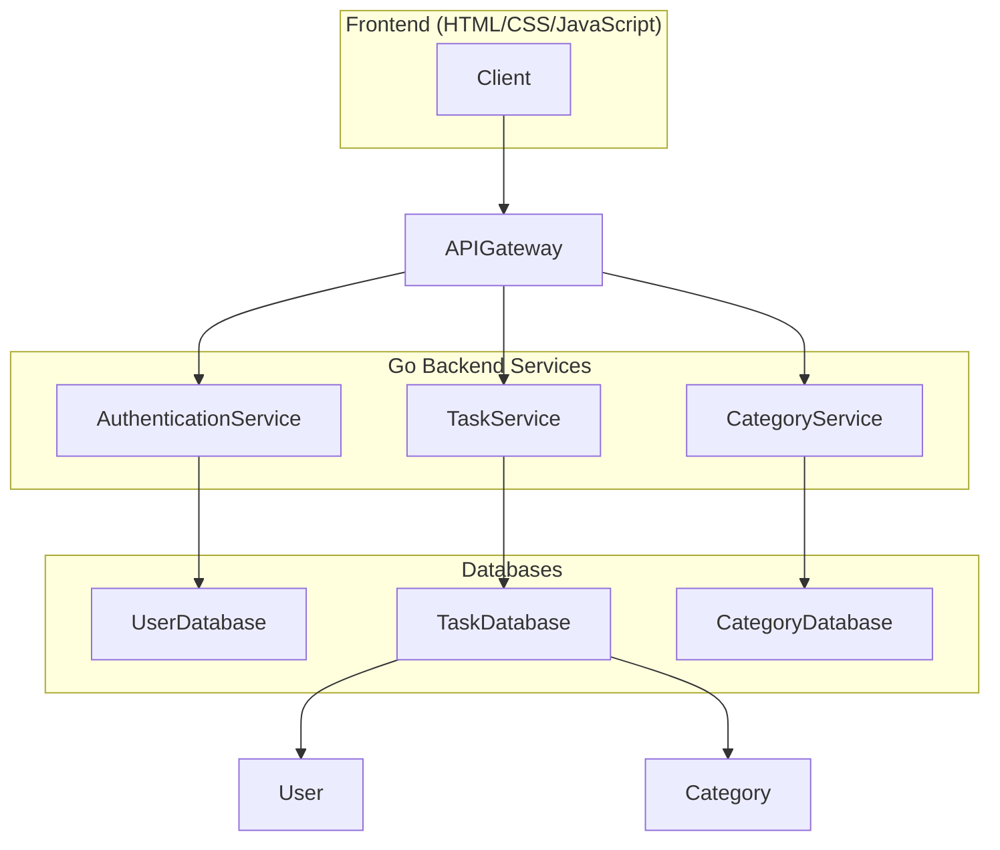

# TaskFlow: A Modern Task Management System

## Overview

TaskFlow is a comprehensive task management application designed to streamline your workflow and enhance productivity. This application combines a robust backend built with Go, providing efficient API endpoints, with a visually appealing and interactive frontend crafted using standard HTML, CSS, and vanilla JavaScript. TaskFlow allows users to register, log in, create, assign, and track tasks, all while providing a clear and intuitive user experience.

## Features

- **User Authentication:** Secure user registration and login functionality to protect sensitive task data.
- **Task Management:** Create, assign, update, and track tasks with detailed descriptions, due dates, and priority levels.
- **Categorization:** Organize tasks into categories for efficient filtering and reporting.
- **API Documentation:** Integrated API documentation using Swagger/OpenAPI to facilitate seamless integration with other systems.
- **Database Backups:** Automated database backups to ensure data integrity and prevent data loss.
- **Git Integration:** Version control using Git to track changes to documents and API definitions.
- **Responsive Design:** A user-friendly interface that adapts seamlessly to different screen sizes and devices.

## Architecture

TaskFlow employs a layered architecture that promotes modularity, scalability, and maintainability.

- **Client:** The frontend interface built with HTML, CSS, and JavaScript, providing users with an interactive task management experience.
- **API Gateway:** Serves as the entry point for all client requests, routing them to the appropriate backend services.
- **Authentication Service:** Handles user authentication and authorization, ensuring secure access to task data.
- **Task Service:** Manages tasks, including creation, assignment, updates, and tracking.
- **Category Service:** Provides functionality for creating, managing, and categorizing tasks.
- **Databases:** Persistent storage for user data, tasks, and categories.

## API Endpoints

The TaskFlow API provides a comprehensive set of endpoints for managing users, tasks, and categories. Below are some examples.

#### User Endpoints

| Method | Endpoint        | Description                                  | Request Body                                                   | Response Body                                                  |
| :----- | :-------------- | :------------------------------------------- | :------------------------------------------------------------- | :------------------------------------------------------------- |
| POST   | `/users/register` | Registers a new user                       | `{username, email, password, first_name?, last_name?}`        | `{id, username, email, first_name?, last_name?, registration_date}` |
| POST   | `/users/login`    | Logs in an existing user                    | `{email, password}`                                          | `{token}`                                                      |
| GET    | `/users/{user_id}` | Retrieves user information (requires authentication) | N/A                                                            | `{id, username, email, first_name?, last_name?, registration_date}` |
| PUT    | `/users/{user_id}` | Updates user information (requires authentication) | `{email?, first_name?, last_name?}`                           | `{id, username, email, first_name?, last_name?, registration_date}` |
| DELETE | `/users/{user_id}` | Deletes a user account (requires authentication) | N/A                                                            | N/A (204 No Content)                                           |

#### Post (Task) Endpoints

| Method | Endpoint          | Description                                 | Request Body                                                   | Response Body                                                  |
| :----- | :---------------- | :------------------------------------------ | :------------------------------------------------------------- | :------------------------------------------------------------- |
| POST   | `/posts`          | Creates a new task                         | `{title, content, author_id, category_ids?}`                 | `{id, title, content, author_id, category_ids?, publication_date, slug}` |
| GET    | `/posts`          | Retrieves a list of tasks (with pagination) | `?page={page}&limit={limit}`                                   | `[{id, title, content, author_id, category_ids?, publication_date, slug}]` |
| GET    | `/posts/{post_id}` | Retrieves a specific task by ID            | N/A                                                            | `{id, title, content, author_id, category_ids?, publication_date, slug}` |
| PUT    | `/posts/{post_id}` | Updates an existing task (requires authentication) | `{title?, content?, category_ids?}`                              | `{id, title, content, author_id, category_ids?, publication_date, slug}` |
| DELETE | `/posts/{post_id}` | Deletes a task (requires authentication)      | N/A                                                            | N/A (204 No Content)                                           |

#### Comment Endpoints

| Method | Endpoint                     | Description                                 | Request Body                                 | Response Body                         |
| :----- | :--------------------------- | :------------------------------------------ | :------------------------------------------- | :------------------------------------ |
| POST   | `/posts/{post_id}/comments` | Creates a new comment on a post             | `{author_id, text}`                          | `{id, post_id, author_id, text, creation_date}` |
| GET    | `/posts/{post_id}/comments` | Retrieves all comments for a specific post | N/A                                          | `[{id, post_id, author_id, text, creation_date}]` |
| PUT    | `/comments/{comment_id}`    | Updates a comment (requires authentication) | `{text?}`                                    | `{id, post_id, author_id, text, creation_date}` |
| DELETE | `/comments/{comment_id}`    | Deletes a comment (requires authentication) | N/A                                          | N/A (204 No Content)                  |

#### Category Endpoints

| Method | Endpoint            | Description                                 | Request Body | Response Body |
| :----- | :------------------ | :------------------------------------------ | :----------- | :------------ |
| POST   | `/categories`       | Creates a new category (requires admin role) | `{name}`     | `{id, name}`  |
| GET    | `/categories`       | Retrieves a list of all categories          | N/A          | `[{id, name}]` |
| GET    | `/categories/{category_id}` | Retrieves a specific category by ID           | N/A          | `{id, name}`  |
| PUT    | `/categories/{category_id}` | Updates a category (requires admin role)      | `{name?}`    | `{id, name}`  |
| DELETE | `/categories/{category_id}` | Deletes a category (requires admin role)      | N/A          | N/A (204 No Content) |

## Data Models

The TaskFlow application utilizes the following data models:

-   **User:** Represents a user account with attributes such as `ID`, `Username`, `Email`, `Password`, `FirstName`, `LastName`, and `RegistrationDate`.
-   **Post:** Represents a task with attributes such as `ID`, `Content`, `Title`, `AuthorID`, `Categories`, `PublicationDate`, and `Slug`.
-   **Comment:** Represents a comment on a task with attributes such as `ID`, `Text`, `AuthorID`, `PostID`, and `CreationDate`.
-   **Category:** Represents a task category with attributes such as `ID` and `Name`.
-   **PostCategory:** Represents the many-to-many relationship between `Post` and `Category`.

## Database Choice

TaskFlow uses **PostgreSQL** as its primary database to ensure data integrity, reliability, and scalability. PostgreSQL offers advanced features such as ACID compliance, data replication, and robust security mechanisms. The application utilizes the `github.com/lib/pq` driver to interact with the PostgreSQL database.

## Model Relationships

TaskFlow defines the following relationships between its data models:

-   **One-to-Many:** A `User` can have multiple `Posts` (tasks) and `Comments`.
-   **Many-to-One:** A `Post` (task) has one `User` as its author. A `Comment` belongs to one `User` and one `Post`.
-   **Many-to-Many:** A `Post` can belong to multiple `Categories`, and a `Category` can be associated with multiple `Posts`, implemented using the `PostCategory` junction table.